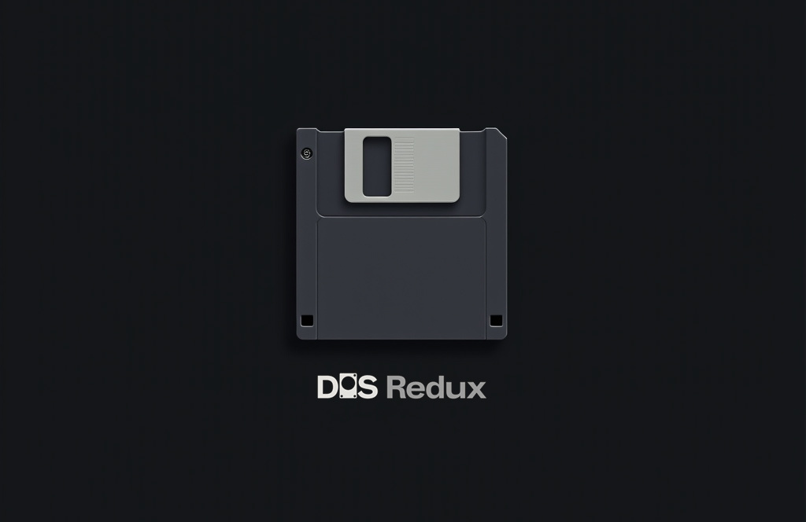

# Project Name: DOS Redux

## Project Overview:
DOS Redux is a modern re-implementation of the classic MS-DOS operating system, designed to run on contemporary hardware while maintaining compatibility with legacy applications. The project aims to provide an open-source, lightweight, and efficient DOS-like environment that supports modern storage, networking, and extended memory features.

## Key Features:
- **Command-line Interface (CLI):** A fully functional DOS-like shell with support for batch scripting.
- **File System Support:** FAT12, FAT16, FAT32 compatibility with possible read-only NTFS support.
- **Memory Management:** Extended memory support beyond the 640KB conventional memory limit.
- **Networking Capabilities:** Basic TCP/IP stack support for modern networking.
- **Virtualization & Booting:** Can run on bare metal or within emulators such as DOSBox, QEMU, or VirtualBox.
- **Legacy Application Support:** Compatibility with common DOS applications and games.
- **Extensibility:** Modular architecture for drivers and extensions.

## Technology Stack:
- **Programming Language:** C, Assembly (x86)
- **Build System:** Make, CMake
- **Version Control:** Git (GitHub repository)
- **Virtualization:** DOSBox, QEMU, VirtualBox
- **Compiler:** GCC, NASM, OpenWatcom

## Project Goals:
1. Create an open-source DOS-compatible operating system with a modern touch.
2. Ensure compatibility with legacy DOS software.
3. Provide an extensible, modular kernel and command shell.
4. Optimize performance for both real hardware and virtualized environments.

## Development Roadmap:
- **Phase 1:** Bootloader & Kernel initialization
- **Phase 2:** Implement basic file system support
- **Phase 3:** Develop a functional command shell
- **Phase 4:** Memory and driver management
- **Phase 5:** Networking & modern enhancements

## Licensing:
DOS Redux will be released under the MIT License to ensure free usage and modification by the open-source community.

## Contribution:
We welcome contributions! Please check our GitHub repository for open issues, feature requests, and contribution guidelines.
